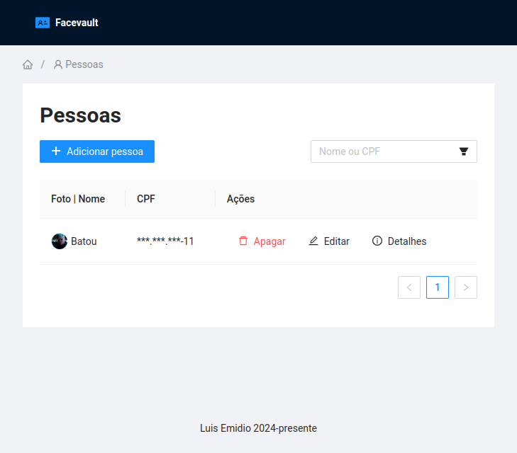

# Facevault

Web system for managing people and their facial biometrics.

This project is a technical challenge that involves developing a web system for user registration, updating, and viewing, including their facial biometrics (face photo). The main focus areas are creating a relational database, an API, and a frontend.

## Features

### Key Features

- **User Registration**: Allow users to register with their name, CPF, and facial biometrics (face photo).
- **List Screen**: Create a screen to list users with anonymized CPFs, with filtering options for original CPFs and names.
- **Detail View**: Develop a detailed view screen displaying anonymized CPFs, names, and user photos.
- **Edit User Details**: Allow users to edit their information, including name and photo.
- **Delete User**: Provide functionality to delete person data securely.
- **CPF Masking and Hashing**: Anonymize and secure CPF data through masking and hashing techniques.

### General Features

- **Error Handling**: Implement robust error handling mechanisms to handle exceptions and edge cases.
- **Loading Handling**: Provide feedback and loading indicators to improve user experience during data operations.
- **Form and DTO Validation**: Validate user input and data transfer objects (DTOs) to ensure data integrity and consistency.
- **Data Persistence**: Ensure that user registration is only completed when all data is correctly saved in the database.

## Installing

Check out [Installation Guide](./docs/README.md).

## Contributing

Check out [Contributing Guide](./CONTRIBUTING.md).

## Possible Improvements

- Development
  - Logging
  - API versioning
  - Git flow
  - Model Mapper for DTO-entity conversion
  - Database Migrations
  - Automated Testing
  - Better Bad request error responses
  - Frontend linting (Eslint)
- Documentation
  - API Documentation
- Security
  - Authentication
  - Better CPF validation
- UX & Performance
  - Caching and loading experience
  - Dynamic icon loading
  - Accessibility
  - Pagination on backend
  - Image saving
  - Batch delete by selection
  - Dynamic param in breadcrumbs

## Tech Stack

### Backend

- Java 21
- PostgreSQL 16.3
- Gradle
- Git
- Spring Boot
  - **Spring Web**: Facilitates the construction of RESTful applications using the Spring MVC framework.
  - **Spring Data JPA**: Simplifies the development of Spring-based applications requiring data source access. Built on the Java Persistence API (JPA), it offers a convenient way to handle data in relational databases.
  - **Spring Initializr**: Tool for quickly generating Spring Boot projects with required dependencies.

Dev Tools:

- **Lombok**: An annotation processor operating at compile time, Lombok reduces a lot of boilerplate code such as getters, setters, and toString().
- **Flyway Migration**: A database migration tool that simplifies versioning and management of changes to your database schema.

### Frontend

- Angular 17
- **Ant Design (NgZorro)**: component library
- **ng-signal-forms**: library for developing forms using signals

Dev Tools:

- Angular CLI
- Node.js
